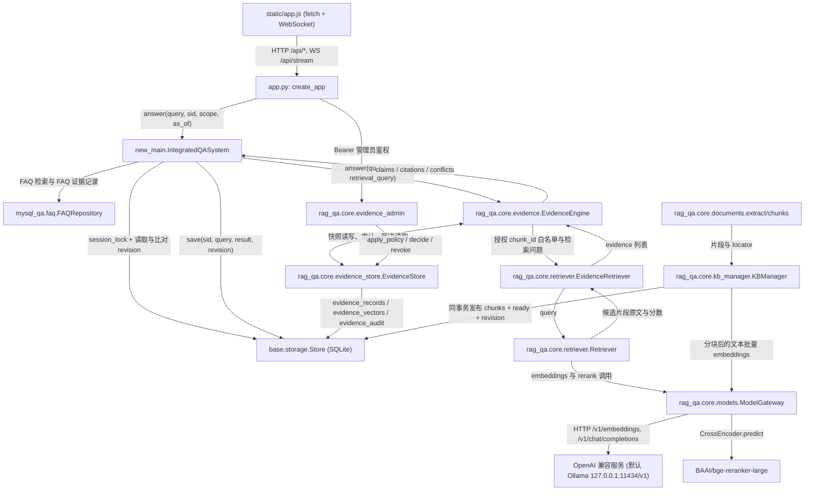

# domain-knowledge-assistant（知识问答助手）

Python + FastAPI 的知识问答助手：dense + BM25 + RRF 混合检索，逐结论证据治理，SQLite 单文件存储，前端为原生 HTML/CSS/JavaScript。
省略传统FQA答案缓存布尔检索、BM25完整检索，仅展示RAG部分
·····知识库更新后台+知识问答助手·····

## 技术栈

| 组 | 组件 | 版本 | 用途 |
|---|---|---|---|
| 后端 | Python | 3.11（`Dockerfile` 基础镜像 `python:3.11-slim-bookworm`） | 运行时 |
| 后端 | FastAPI | 0.115.12 | HTTP 与 WebSocket 路由 |
| 后端 | Uvicorn | 0.41.0 | ASGI 服务 |
| 后端 | Pydantic | 随 FastAPI `0.115.12` | 请求模型（`extra='forbid'`、`strict=True`）与管理接口策略校验 |
| 后端 | openai | 2.24.0 | chat 与 embeddings 的 OpenAI 兼容客户端 |
| 后端 | numpy | 2.2.6 | 向量归一化与余弦打分 |
| 后端 | rank-bm25 | 0.2.2 | `BM25Plus` 稀疏检索 |
| 后端 | python-multipart | 0.0.27 | 上传表单解析 |
| 后端 | httpx | 0.27.2 | 命令行脚本的 HTTP 客户端 |
| 后端 | websockets | 16.0 | 命令行脚本的 WebSocket 客户端 |
| 后端 | PyMuPDF | >=1.24,<2 | PDF 文本与页码 |
| 后端 | python-docx | >=1.1,<2 | DOCX 段落与表格 |
| 后端 | python-pptx | >=1.0,<2 | PPTX 幻灯片 |
| 后端 | sentence-transformers | 3.0.1（`requirements-reranker.txt`） | 本地 CrossEncoder 重排序 |
| 后端 | transformers | 4.45.0（`requirements-reranker.txt`） | CrossEncoder 依赖 |
| 后端 | torch | >=2.2,<3（`requirements-reranker.txt`） | 重排序推理，`set_num_threads(4)` |
| 前端 | 原生 HTML5 / CSS / ES2020 | 无外部依赖 | 页面、样式、交互，无构建步骤、无 npm 依赖 |
| 前端 | WebSocket | 浏览器原生 | 流式回答通道 |
| 基础设施 | SQLite | Python 标准库 `sqlite3`，`journal_mode=WAL` | 会话、历史、FAQ、文件、片段、证据快照 |
| 基础设施 | Docker / Compose | `docker-compose.yml` 单服务 `assistant` | 应用与命名卷 `assistant_data` |
| 外部依赖 | OpenAI 兼容 chat 服务 | 默认 `http://127.0.0.1:11434/v1`，模型 `qcwind/qwen3-8b-instruct-Q4-K-M:latest` | 证据选择与语义审核，需支持 `response_format=json_object` 与流式输出 |
| 外部依赖 | OpenAI 兼容 embeddings 服务 | 默认 `http://127.0.0.1:11434/v1`，模型 `bge-m3:latest` | 文档与问题嵌入 |
| 外部依赖 | CrossEncoder 权重 | 默认 `BAAI/bge-reranker-large`，`device=cpu`，`max_length=512` | 候选重排序 |

表中的模型与地址取自 `config.example.ini` 的默认值。项目不安装 Ollama、不下载模型权重；中间件只有 SQLite 一个文件，不需要 MySQL、Redis、Milvus 或消息队列（`requirements*.txt` 与 `docker-compose.yml` 中没有对应依赖或服务）。

## 架构



`new_main.IntegratedQASystem.compatible`（`new_main.py:31-46`）把证据引擎的 `overall_status` 映射为前端状态：`supported→answered`、`partial→partial`、`conflicted→conflicted`、`missing→insufficient`（索引状态为 `not_imported` / `pending` / `failed` 时改为 `empty` / `indexing` / `index_failed`）、`needs_clarification→clarify`、`retry_required` 与 `service_error→error`；同时把 `citations` 重写为 `sources`，把正文里的 `[来源](evidence:<id>)` 替换为序号引用。失败回答不写历史（`new_main.py:57-59`）。

## 模块与技术映射

| 模块 | 目录路径 | 用到的技术 / 库 / 算法 | 关键文件 | 一句话职责 |
|---|---|---|---|---|
| HTTP / WebSocket 传输 | `app.py` | FastAPI 0.115.12、Pydantic v2（`extra='forbid'`、`strict=True`）、Starlette WebSocket、StaticFiles | `app.py:11-19,54-180` | 23 条路由（应用侧 17 条、管理复核 6 条）、Bearer 管理员 token（7200 秒）、登录失败限流 10 次/60 秒、上传尺寸限额 |
| 问答单入口与编排 | `new_main.py` | `threading.Lock` 64 分片（sha256(sid) 取模）、revision 乐观校验、指代补全正则 | `new_main.py:16-79` | HTTP 与 WS 共用 `IntegratedQASystem.answer`，会话串行、失败不落历史 |
| 配置 | `base/config.py` | `configparser`(interpolation=None)、`dataclass(frozen=True)`、环境变量覆盖、启动期断言 | `base/config.py:41-83` | INI 与环境变量，非法组合拒绝启动 |
| 持久化 | `base/storage.py` | sqlite3（WAL、`foreign_keys=ON`、timeout=15）、`RLock`、单调 revision | `base/storage.py:9-91` | 单实例 SQLite：meta / sessions / history / faq / files / chunks |
| 文档解析与分块 | `rag_qa/core/documents.py` | PyMuPDF(fitz)、python-docx、python-pptx、zipfile 解压限额、sha256 | `documents.py:7-70` | 按格式提取，记录页 / 章节 / 幻灯片 / 字符偏移 locator |
| 混合检索 | `rag_qa/core/retriever.py` | NumPy 归一化向量矩阵乘（余弦）、rank-bm25 `BM25Plus`、RRF(k=60)、CrossEncoder、阈值过滤 | `retriever.py:10-65` | dense 与 sparse 融合、重排、阈值、top-k |
| 模型网关 | `rag_qa/core/models.py` | openai SDK（base_url、stream、`response_format=json_object`）、sentence-transformers CrossEncoder 与 torch sigmoid | `models.py:7-78` | 嵌入（批量 16、校验维度与非有限值）、证据选择、本地重排 |
| 证据注册表 | `rag_qa/core/evidence_store.py`、`migrations/001_evidence.sql` | SQLite JSON 快照表、`stable_id` sha256、审计表、幂等回填 | `evidence_store.py:23-140` | 文档 / 版本 / 片段快照，与业务写入同事务发布 |
| 证据引擎 | `rag_qa/core/evidence.py` | 白名单校验、连续原文字符串核验、`ThreadPoolExecutor(max_workers=4)` 独立语义审核、标量冲突检测、服务端拼装正文 | `evidence.py:13-499` | 逐结论绑定证据，未通过核验的文字不进回答 |
| 管理复核 | `rag_qa/core/evidence_admin.py` | Pydantic 请求模型、policy 字段校验（生效区间 / 替代 / 撤销）、审计与撤销 | `evidence_admin.py:18-153` | 管理员修正元数据、裁决冲突、撤销并留审计 |
| 索引管理 | `rag_qa/core/kb_manager.py` | 单线程 `ThreadPoolExecutor`（`max_workers=1`）、UUID 目录、同事务原子发布、重启中断标记 | `kb_manager.py:13-104` | 上传到 ready 的可恢复索引状态机 |
| FAQ | `mysql_qa/faq.py` | csv 与 json 解析、NFKC 归一化、中文 bigram 分词、`BM25Plus`、Jaccard 阈值 0.90 与 margin 0.15 | `faq.py:12-73` | question / answer 导入（按问题 upsert）与保守模糊匹配 |
| 前端 | `static/` | 原生 HTML/CSS/JS（无构建、无框架）、WebSocket 客户端、localStorage 与 sessionStorage、DOM API 渲染（无 innerHTML） | `index.html`、`app.js`、`style.css` | 问答页、知识库管理页、引用侧栏、复核面板 |

规模：Python 40 个文件 / 3800 行，前端 3 个文件 / 584 行。

## 关键实现

**混合检索与 RRF 融合**（`rag_qa/core/retriever.py:10-44`）：问题 → `ModelGateway.embeddings` 取归一化向量 → `vectors @ query_vector` 得余弦分，同时用 `BM25Plus` 得稀疏分 → 两路各取 `retrieval_k`（15）个候选 → 按 `1/(60+rank+1)` 累加融合排序 → 余弦低于 `similarity_threshold`（0.25）的候选丢弃 → `CrossEncoder` sigmoid 重排并按 `rerank_threshold`（0.5）过滤，`reranker_backend=disabled` 时退回余弦分并用 `similarity_threshold` → 截断到 `candidate_m`（3）。嵌入签名（`embedding_url`、`embedding_model`、向量维度）存在 SQLite `meta.embedding`，签名不一致时抛错并要求换 `data_dir` 重新导入。

**逐结论证据治理**（`rag_qa/core/evidence.py:234-360`）：`EvidenceEngine` → 对 `_available(ctx)` 产出的 chunk_id 白名单 → 模型返回的每条 claim 逐项校验 evidence_id 在白名单内、quote 是注册表原文的子串、数字与否定词守卫通过（`contradiction_guard`）、`source_kind=reported` 的证据要求 claim 声明 speaker → 每条 claim 单独发起一次审核请求（`ThreadPoolExecutor(max_workers=4)`，处理前 `MAX_SEMANTIC_REVIEWS`（8）条）→ 冲突按 (subject, attribute, scope, conditions, kind, speaker) 分桶，标量值不一致先判，未决时最多 4 次兼容性审核 → 正文由服务端按 claim 状态拼装，未通过的 claim 正文替换为「无法确认：<子问题>」并清空 value、quotes 与证据 ID；单次回答最多 24 条证据、32 条候选、2 次混合检索。模型提示把资料、问题与历史声明为不可信数据（`rag_qa/core/evidence.py:140-154`）。

**证据快照与版本注册表**（`rag_qa/core/evidence_store.py:67-140`）：上传、索引、删除、FAQ upsert → 在同一个 SQLite 事务内 `sync()` 投影出 `document`、`version`、`chunk` 三类记录 → 检索用向量写入 `evidence_vectors` → 每次变更在 `evidence_audit` 留 before 与 after → 首次启动回填旧索引：重新解析上传副本，仅当 chunk ID 与正文完全一致时建立 locator 快照，不匹配记 `unresolved` 并返回 `unindexed`，重复启动幂等。locator 保存解析得到的字符偏移以及 PDF 页码、Markdown 标题、PPTX 幻灯片序号，DOCX 与 TXT 没有真实页码时不生成该字段（`rag_qa/core/documents.py:22-41`、`new_main.py:40-43`）。

**索引状态机与原子发布**（`rag_qa/core/kb_manager.py:24-102`）：上传 → 建 UUID 目录并登记 `uploaded` → 单线程 `ThreadPoolExecutor(max_workers=1)` 转 `indexing` → `documents.chunks` 按 `chunk_size`（默认 700）与 `chunk_overlap`（默认 80）分块 → 批量嵌入 → 同一事务写 `chunks`、置 `ready`、提升 revision；异常置 `failed` 并把原因截断到 200 字符；进程重启把遗留的 `uploaded` 与 `indexing` 标为 `failed`（`base/storage.py:33`）；删除先在事务内删文件行与级联片段、提升 revision，再清理上传副本。

**会话串行与 revision 双检**（`new_main.py:48-79`、`base/storage.py:74-79`）：64 个锁按 `sha256(sid)` 取模分片，同一会话的请求串行执行 → `answer` 开始时读取 revision，写历史时 `save()` 再比对，不一致抛 `KNOWLEDGE_CHANGED` → 返回 `retry_required` 且 `saved=False`，成功历史不写入 → 历史读取时 revision 不一致的行正文替换为提示、来源清空。追问上下文只用紧邻上一轮且同 revision 的成功问题（`new_main.py:72-77`），拼接上限 4000 字符。

**核验后流式下发**（`app.py:92-122`）：WebSocket `/api/stream` 校验 Origin 后接收请求 → 发送 `start` 与 `status` 事件 → 在线程中执行完整问答 → `meta` 事件带全部非正文结果 → 正文按 24 字符分段、间隔 0.005 秒发送 `token` → `end` 事件带最终结果。核验失败的文字不出现在 `token` 序列中，单条请求消息上限 12000 字符。

## 快速开始

依赖中间件：无。需要能访问的 OpenAI 兼容 chat 与 embeddings 服务，以及本地 CrossEncoder 权重目录（或允许从模型仓库下载）。首次启动 `data/` 为空，页面显示尚未导入资料属正常状态。

```bash
cd /path/to/domain-knowledge-assistant
python3.11 -m venv .venv
source .venv/bin/activate
python -m pip install -r requirements.txt
cp config.example.ini config.ini
# 按实际的模型服务地址与模型名修改 [model]
python scripts/start.py          # 隐藏输入管理员密码后启动
```

不准备重排序模型时可只装核心依赖并显式关闭：

```bash
python -m pip install -r requirements-core.txt
RERANKER_BACKEND=disabled python scripts/start.py
```

也可以自行设置凭据后直接启动：`KB_ADMIN_PASSWORD=<你的密码> python app.py`。`scripts/start.py` 用 `getpass` 读取密码，不写入文件（`scripts/start.py:9-12`）。原项目文档记录 Python 3.10 至 3.12 可用，`docs/VALIDATION.md` 的实现环境是 Conda Python 3.10，`Dockerfile` 固定 3.11。

端口：服务默认监听 `127.0.0.1:8080`（`HOST`、`PORT` 环境变量，`app.py:183-185`），页面在 `http://127.0.0.1:8080`，健康检查 `/health`。Compose 绑定 `127.0.0.1:${APP_PORT:-8080}:8080`，容器内 `HOST=0.0.0.0`，命名卷 `assistant_data` 挂到 `/app/data`，宿主模型服务经 `host.docker.internal` 访问（`docker-compose.yml`）。

环境变量：

| 变量 | 默认 | 作用 |
|---|---|---|
| `KB_ADMIN_USERNAME` | `admin` | 管理员用户名 |
| `KB_ADMIN_PASSWORD` | 空 | 管理员密码；为空时 `/api/kb/login` 返回 503，没有默认密码 |
| `ASSISTANT_CONFIG` | 项目内 `config.ini` | 指定 INI 路径 |
| `ASSISTANT_DATA_DIR` | 项目内 `data/` | 数据目录，含 `assistant.sqlite3` 与 `uploads/` |
| `ASSISTANT_<键名大写>` | INI 值 | 覆盖任意 INI 键，例如 `ASSISTANT_NAME`、`ASSISTANT_RETRIEVAL_K` |
| `LLM_BASE_URL` / `LLM_MODEL` / `LLM_API_KEY` | `http://127.0.0.1:11434/v1` / `qcwind/qwen3-8b-instruct-Q4-K-M:latest` / 空 | chat 服务 |
| `EMBEDDING_BASE_URL` / `EMBEDDING_MODEL` / `EMBEDDING_API_KEY` | `http://127.0.0.1:11434/v1` / `bge-m3:latest` / 空 | embeddings 服务 |
| `RERANKER_MODEL` / `RERANKER_DEVICE` / `RERANKER_BACKEND` | `BAAI/bge-reranker-large` / `cpu` / `cross_encoder` | 重排序权重、设备、后端（`cross_encoder` 或 `disabled`） |
| `HOST` / `PORT` | `127.0.0.1` / `8080` | 监听地址与端口 |

`.env` 不会被自动加载（依赖里没有 dotenv），`.env.example` 只是占位示例；API key 只从环境变量读取，不写进 INI（`base/config.py:61-64`）。

INI 配置键与默认值（`base/config.py:53-82`、`config.example.ini`）：

| 节 | 键 | 默认值 |
|---|---|---|
| `[assistant]` | `name` / `description` / `welcome` | 知识问答助手 / 依据你导入的常见问答与知识文档回答问题。 / 你好，请描述你想了解的问题。我会依据已导入资料回答。 |
| `[assistant]` | `suggestions` | `[]`（JSON 字符串数组） |
| `[assistant]` | `insufficient_action` | `clarify`（或 `refuse`）；`clarify` 提示补充资料，`refuse` 只说明不足 |
| `[assistant]` | `allow_general_chat` | `false`；设为 `true` 直接拒绝启动，当前版本没有闲聊分支 |
| `[storage]` | `max_upload_mb` | `20` |
| `[storage]` | `data_dir` | 项目内 `data/` |
| `[model]` | `llm_url` / `llm_model` | `http://127.0.0.1:11434/v1` / `qcwind/qwen3-8b-instruct-Q4-K-M:latest` |
| `[model]` | `embedding_url` / `embedding_model` | `http://127.0.0.1:11434/v1` / `bge-m3:latest` |
| `[model]` | `reranker_backend` / `reranker_model` / `reranker_device` | `cross_encoder` / `BAAI/bge-reranker-large` / `cpu` |
| `[model]` | `model_timeout` | `180`（秒） |
| `[retrieval]` | `retrieval_k` / `candidate_m` | `15` / `3` |
| `[retrieval]` | `similarity_threshold` / `rerank_threshold` | `0.25` / `0.5` |
| `[retrieval]` | `chunk_size` / `chunk_overlap` | `700` / `80` |
| `[faq]` | `enabled` / `threshold` / `margin` | `true` / `0.90` / `0.15` |

启动期校验（`base/config.py:76-82`）：`candidate_m <= retrieval_k <= 100`、`0 <= chunk_overlap < chunk_size <= 4000`、四个阈值都在 `[0,1]`、`reranker_backend` 与 `insufficient_action` 取值受限，不满足即抛错退出。

管理员账号：用户名默认 `admin`，密码必须由部署者通过 `KB_ADMIN_PASSWORD` 提供，没有默认值；未配置时登录返回 503。问答侧不需要账号，`/api/create_session` 返回随机 UUID 作为会话凭据。

导入资料：FAQ 用 UTF-8 JSON 或 CSV，字段为 `question` 与 `answer`（示例见 `demo/faq.json`、`demo/faq.csv`），单次 1 到 10000 条，重复问题按 `question` upsert 更新答案，整个文件先校验后事务提交。命令行导入：

```bash
python scripts/import_faq.py /path/to/my-faq.json --url http://127.0.0.1:8080
python scripts/convert_faq.py 输入.csv 输出.json --question-column 问题 --answer-column 答案   # 输出已存在时拒绝执行
```

文档从管理页上传，支持 `.md`、`.txt`、`.pdf`、`.docx`、`.pptx`、`.csv`，同名文件拒绝覆盖，列表状态依次为 `uploaded`（等待索引）、`indexing`、`ready`（可检索）或 `failed`。`demo/` 中的星盒资料是虚构数据，不随启动自动导入；建议先用独立数据目录试跑：

```bash
ASSISTANT_DATA_DIR=/tmp/my-assistant-test python scripts/start.py
```

Docker：

```bash
KB_ADMIN_PASSWORD=<你的密码> docker compose up --build
```

数据目录：`ASSISTANT_DATA_DIR` 决定唯一数据库与上传目录；更换嵌入模型或服务地址后应使用新的数据目录重新导入，维度或签名不一致时检索直接报错。聊天模型可以直接更换，不需要重建嵌入。`data/` 与 `.local/` 均不进入版本控制（`.gitignore`）。

## 目录结构

```
domain-knowledge-assistant/
├── app.py                  # FastAPI 应用工厂、17 条路由、管理员鉴权与登录限流
├── new_main.py             # IntegratedQASystem：唯一问答路径、会话锁、revision 校验
├── base/
│   ├── config.py           # INI 与环境变量配置、启动期校验
│   └── storage.py          # SQLite 表结构、连接上下文、历史与 revision
├── rag_qa/core/
│   ├── documents.py        # 格式解析、分块、locator 元数据
│   ├── retriever.py        # dense 与 BM25 检索、RRF、CrossEncoder、FAQ 侧路
│   ├── models.py           # OpenAI 兼容调用、嵌入校验、CrossEncoder 重排
│   ├── evidence_store.py   # 证据快照注册表、审计、幂等回填
│   ├── evidence.py         # 证据白名单、语义审核、冲突分组、正文拼装
│   ├── evidence_admin.py   # 管理员元数据修正、冲突裁决、撤销与审计接口
│   └── kb_manager.py       # 单线程索引状态机、原子发布、删除与重建
├── mysql_qa/faq.py         # FAQ 导入、NFKC 归一化、BM25 候选与保守匹配
├── static/                 # index.html、app.js、style.css、favicon.svg
├── migrations/001_evidence.sql  # 证据表增量迁移
├── scripts/                # start.py 启动器、import_faq.py、convert_faq.py
├── tests/                  # Mock 模型契约与失败用例
├── demo/                   # 虚构 FAQ 与三份星盒 Markdown
├── docs/                   # 架构、迁移、前端改造、验收记录与结果 JSON
├── Dockerfile              # python:3.11-slim-bookworm，非 root 用户，HEALTHCHECK /health
├── docker-compose.yml      # 单服务与命名卷，不含旧项目中间件
├── config.example.ini      # 配置模板
└── requirements*.txt       # core / reranker / 完整 / macOS 依赖清单
```

## Example Scenarios

| 场景 | 问题 | 预期 |
|---|---|---|
| 精确 FAQ | 星盒工具是什么？ | 常见问答来源 |
| 文档检索 | 星盒出现 E17 应该怎么处理？ | 故障处理文件、片段 ID、连续原文 |
| 无答案 | 星盒企业版每年的价格是多少？ | 资料不足，不编造价格 |
| 追问澄清 | 星盒导出怎么设置？ | 询问具体导出模式 |
| 上下文 | E17 回答后问：如果仍然出现呢？ | 延续 E17，只引用当前可用资料 |

## 已知限制 / 未实现

- 不做 OCR：`rag_qa/core/documents.py:69` 在无可提取文本时直接报错，扫描件与图片需先自行 OCR；`.doc`、`.ppt`、`.xls` 与图片格式不在 `SUPPORTED` 集合内。
- 覆盖上传只有 `PUT /api/kb/files/{fid}` 接口，前端没有对应入口（`static/app.js` 只调用 upload、rebuild、delete）。换个版本的文档只能换文件名上传，或删除后重新上传。
- 旧字段 `source_filter` 已移除：请求体带该字段时 HTTP 返回 422、WebSocket 返回 `error`（`app.py:20-25,92-107`），检索不接受该参数，也没有按旧条件生成的答案缓存。
- 问答身份固定为 `anonymous`（`rag_qa/core/evidence.py:21-41`），`restricted` 资料在问答链路一律不可用；管理员登录只用于管理，不赋予问答角色。没有多租户、用户账号、计费与跨设备会话。
- 无工具调用、无 Agent 分支；通用闲聊关闭，`allow_general_chat=true` 会导致启动失败，问候只匹配整串（`new_main.py:68`）。
- 没有答案缓存，也没有 Redis 或任何外部缓存组件：`rag_qa/core/evidence.py:479` 固定 `cache={'enabled': False}`，`requirements*.txt` 中没有任何缓存或队列客户端，`docker-compose.yml` 只有 `assistant` 一个服务与 `assistant_data` 一个卷。原教育版按问题缓存答案的做法（`docs/MIGRATION.md:16`）没有迁入，因此每次提问都会重新检索并调用模型；知识、权限或复核结果变化即提升 revision，历史回答正文与来源隐藏并要求重新查询。
- 单进程、单 worker：请勿使用多个 Uvicorn worker。检索对全部就绪片段做本地矩阵计算，适合小知识库；未做规模与并发压力测试（`docs/VALIDATION.md`）。
- 上下文只有紧邻上一轮规则（`new_main.py:72-77`），复杂多话题对话需要用户重新指明对象；历史只用于理解指代，不作为事实来源。
- 语义审核由模型完成，可能误拒或漏判，超过 `MAX_SEMANTIC_REVIEWS`（8）条的候选不上审核；冲突兼容性审核单次最多 4 次。检索与重排序分数是模型打分，不是答案正确率或校准概率，换领域或模型后需要重做评测。
- 来源权威等级不参与自动裁决：`authority.level` 非 `unknown` 时只要求管理员给出依据（`rag_qa/core/evidence_admin.py:48-49`），系统不会据此自动选边；无明确替代或裁决依据的冲突保留各方原文。
- Docker 路径没有完成真实验收：`docs/VALIDATION.md` 只做了 `docker compose config --quiet` 的编排校验，没有构建镜像或跑容器端到端；仅绑定宿主 loopback 的模型服务在容器内可能不可达。
- 会话 ID 是随机 UUID，作为本地持有者凭据，没有账号层所有权校验；历史列表保存在当前浏览器，会话内容保存在 SQLite，不适合未经访问控制直接开放到公网。
- `.local/` 下的本机脚本被 `.gitignore` 排除，`.local/start.command` 硬编码了 Conda 解释器路径与本机 `bge-reranker-large` 绝对路径，换机器不可用。